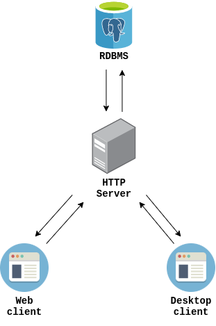

# db-course-project-app
:book: System for test passing.
This is course project by 'Database'. It was deployed to [Heroku](https://www.heroku.com/).

## Architecture
There are two clients (web and desktop), 
RDBMS ([PostgreSQL](https://www.postgresql.org/)) and HTTP server on [Express](http://expressjs.com/):

Desktop client works through [Electron](https://www.electronjs.org/). 
Main router checks `user-agent` header and if there is `Electron` substring then server sends the desktop version.
Else it sends web version.

## Report
Link to description about project: 
[db-course-project-report](https://github.com/swimmwatch/db-course-project-report).
